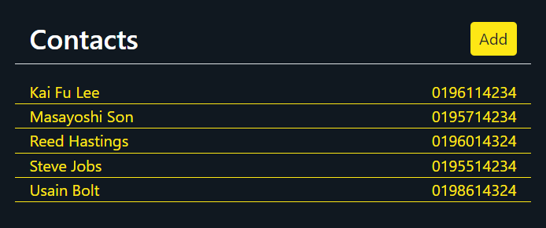

## A Simple React-Django Phonebook



### Installation Instructions (For PowerShell)

1. Clone the project.
    ```
    > git clone https://github.com/HeLinChooi/Simple-React-Django-Phonebook.git
    ```
2. `cd` intro the project directory
    ```
    > cd Simple-React-Django-Phonebook
    ```
3. Create a new virtual environment using Python 3.7 and activate it.
    ```
    > py -m venv venv-name
    > venv-name/Scripts/activate
    ```
4. Install dependencies from requirements.txt:
    ```
    (venv-name)> pip install django djangorestframework
    ```
5. Run the local server via:
    ```
    (venv-name)> python manage.py runserver
    ```
6. To stop the development, stop the server by pressing `Ctrl+C`
7. Exit the virtual environment
    ```
    (venv-name)> deactivate
    ```